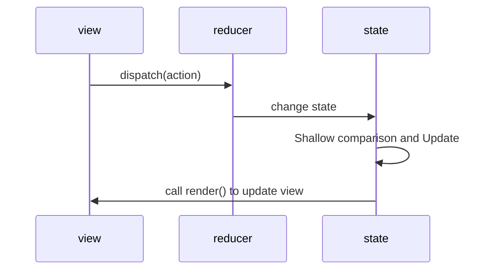

# React

## Lifecycles


- getDerivedStateFromProps: Keeping the props always is the same as New props

- shouldComponentUpdate: We can control the components which should be re rendered

- getSnapshotBeforeUpdate: The snapshot before update

```react
// Life cycle is for class components, and function components are simulated by hooks
import React, { Component } from "react";

class Cpn extends Component {
  render() {
    return (
      <div>
        <h2>我是Cpn组件</h2>
      </div>
    );
  }

  componentWillUnmount() {
    console.log("componentWillUnmount called");
  }
}

export default class App extends Component {
  /**
   * 1.init state
   * 2.bind this pointer
   */
  constructor() {
    super();

    this.state = {
      count: 0,
      isShow: false,
    };

    console.log("constructor called");
  }

  render() {
    console.log("render called");
    return (
      <div>
        <span>App</span>
        <h2>Counter: {this.state.count}</h2>
        <button onClick={(e) => this.increment()}>+1</button>

        <hr />
        <button onClick={(e) => this.changeCpnShow()}>change</button>
        {this.state.isShow && <Cpn />}
      </div>
    );
  }

  changeCpnShow() {
    this.setState({
      isShow: !this.state.isShow,
    });
  }

  increment() {
    this.setState({
      count: this.state.count + 1,
    });
  }

  /**
   * 1.Operation dependent on DOM
   * 2.Send the network(Vue->created)
   * 3.add some subscribe(unsubscribe in componentWillUnmount)
   */
  componentDidMount() {
    console.log("componentDidMount called");
  }

  /**
   * 1.Be called after component updated
   * 2.Compare the props
   */
  componentDidUpdate(prevProps, prevState, snapshot) {
    console.log("componentDidUpdate called");
  }
}
```

### shouldComponentUpdate

```react
// Use the shouldComponentUpdate controls the render function
import React, { Component } from "react";

export default class App extends Component {
  constructor() {
    super();

    this.state = {
      counter: 0,
      message: "Hello World",
    };
  }

  render() {
    console.log("App called");
    return (
      <div>
        <h2>counter: {this.state.counter}</h2>
        <h2>message: {this.state.message}</h2>
        <button
          onClick={(e) => {
            this.increment();
          }}
        >
          +
        </button>
        <button
          onClick={(e) => {
            this.changeText();
          }}
        >
          ChangeText
        </button>
      </div>
    );
  }

  // Determine whether the component is updated
  shouldComponentUpdate(nextProps, nextState) {
    // console.log("nextState", nextState);
    if (this.state.counter !== nextState.counter) return true;
    return false;
  }

  increment() {
    this.setState({
      counter: this.state.counter + 1,
    });
  }

  changeText() {
    this.setState({
      message: "Small Stars",
    });
  }
}

```

### super

- super(props): Superclass will help you to keep the props:

  ```react
  import React, { Component } from "react";
  export default class App extends Component {
    constructor(props) {
      super(props);
    }

    render() {
      return (
        <div>App</div>
      );
    }
  }
  ```

- But we use super() also can run

  ```react
  import React, { Component } from "react";
  export default class App extends Component {
    constructor() {
      super();
    }
    render() {
      return (
        <div>App</div>
      );
    }
  }
  ```

- Subclass will auto execute the constructor function, we can not write it

  ```react
  import React, { Component } from "react";
  export default class App extends Component {
    render() {
      return (
        <div>App</div>
      );
    }
  }
  ```

## [propTypes & defaultProps](https://zh-hans.reactjs.org/docs/typechecking-with-proptypes.html)

```react
import React, { Component } from "react";
import Proptypes from "prop-types";

// Function
function ChildCpn(props) {
  const { name, age, height } = props;
  const { names } = props;

  return (
    <div>
      <h2>SubComponent:{name + " " + age + " " + height}</h2>
      <div>
        {names.map((item, index) => {
          return <li key={index}>{item}</li>;
        })}
      </div>
    </div>
  );
}

// Class
class ChildCpn2 extends Component {
  static propTypes = {};
  static defaultProps = {};

  render() {
    const { name, age, height, names } = this.props;

    return (
      <div>
        <h2>SubComponent2:{name + " " + age + " " + height}</h2>
        <div>
          {names.map((item, index) => {
            return <li key={index}>{item}</li>;
          })}
        </div>
      </div>
    );
  }
}

// Custom Validation Rule
ChildCpn.propTypes = {
  name: Proptypes.string.isRequired,
  age: Proptypes.number,
  height: Proptypes.number,
  names: Proptypes.array,
};

ChildCpn2.propTypes = {
  name: Proptypes.string,
  age: Proptypes.number,
  height: Proptypes.number,
  names: Proptypes.array,
};

// defaultValue
ChildCpn.defaultProps = {
  name: "HelloKitty",
  age: 30,
  height: 1.78,
  names: ["default"],
};

ChildCpn2.defaultProps = {
  name: "BlackAngel",
  age: 30,
  height: 1.78,
  names: ["default"],
};

export default class App extends Component {
  render() {
    return (
      <div>
        <ChildCpn
          name="Smallstars"
          age={18}
          height={1.83}
          names={["abc", "de"]}
        />

        <ChildCpn />

        <ChildCpn2 age={18} height={1.83} names={["abc", "de"]} />
      </div>
    );
  }
}
```

## setState

- Asynchronous: In the Lifecycles and the CompositeEvent of React

  ```react
  import React, { Component } from "react";

  class App extends Component {
    constructor() {
      super();

      this.state = {
        message: "default Text",
      };
    }

    // Call back after the render function is executed
    componentDidUpdate() {
      console.log("componentDidUpdate", this.state.message); // Smallstars
    }

    changeText() {
      this.setState(
        {
          message: "Smallstars",
        },
        () => {
          // Call back after the data are updated
          console.log("changeText", this.state.message); // Smallstars
        }
      );

      console.log("changeText", this.state.message); // default Text
    }

    render() {
      const { message } = this.state;
      return (
        <div>
          <div>{message}</div>
          <button
            onClick={() => {
              this.changeText();
            }}
          >
            synchronous
          </button>
        </div>
      );
    }
  }

  export default App;
  ```

- Synchronous: In setTimeout and native event of DOM

  ```react
  import React, { Component } from "react";

  class App extends Component {
    constructor() {
      super();

      this.state = {
        message: "default Text",
      };
    }

    componentDidMount() {
      document.getElementById("btn_synchronous").addEventListener("click", () => {
        this.setState({
          message: "Smallstars",
        });

        console.log("document", this.state.message); // Smallstars
      });

      // this.setState({
      //   message: "Smallstars",
      // });
      // console.log("componentDidMount", this.state.message); // default Text
    }

    changeText() {
      setTimeout(() => {
        this.setState({
          message: "Smallstars",
        });
        console.log("setTimeout", this.state.message); // default Text
      }, 0);

      this.setState({
        message: "Smallstars",
      });
      console.log("changeText", this.state.message); // default Text
    }

    render() {
      const { message } = this.state;
      return (
        <>
          <div>message: {message}</div>
          <button id="btn_synchronous">synchronous</button>
          <button
            onClick={() => {
              this.changeText();
            }}
          >
            synchronous
          </button>
        </>
      );
    }
  }

  export default App;
  ```

- Data merging

  ```react
  import React, { Component } from "react";

  export default class App extends Component {
    constructor(props) {
      super();
      this.props = props;

      this.state = {
        message: "Default Text",
        name: "Smallstars",
      };
    }

    render() {
      return (
        <div>
          <h2>message: {this.state.message}</h2>
          <h2>{this.state.name}</h2>
          <button
            onClick={(e) => {
              this.changeText();
            }}
          >
            execute
          </button>
        </div>
      );
    }

    changeText() {
      // Use Object.assign({}, this.state, {message: "Smallstars"})
      this.setState({
        message: "Smallstars",
      });
    }
  }
  ```

- setState merging

  ```react
  import React, { Component } from "react";

  export default class App extends Component {
    constructor(props) {
      super();
      this.props = props;

      this.state = {
        counter: 0,
      };
    }

    render() {
      return (
        <div>
          <h2>Number: {this.state.counter}</h2>
          <button
            onClick={(e) => {
              this.increment();
            }}
          >
            +
          </button>
        </div>
      );
    }

    increment() {
      // It is merged each time, and the front is covered by later
      // this.setState({
      //   counter: this.state.counter + 1,
      // });

      // this.setState({
      //   counter: this.state.counter + 1,
      // });

      // this.setState({
      //   counter: this.state.counter + 1,
      // });
      // counter is 1

      // Accumulate when merging
      // Each time a merging is made, the later state is used for accumulation, and then a new one is returned
      this.setState((prevState, props) => {
        return {
          counter: prevState.counter + 1,
        };
      });
      this.setState((prevState, props) => {
        return {
          counter: prevState.counter + 1,
        };
      });
      this.setState((prevState, props) => {
        return {
          counter: prevState.counter + 1,
        };
      });
      // counter is 3
    }
  }
  ```

## ReactCompositeEvent

React is not just design for browsers


## Components Communication

### Parent and Child Component

- Class Component

  ```react
  import React, { Component } from "react";
  class ChildCpn extends Component {
    render() {
      const { name, age, height } = this.props;
      return (
        <div>
          <h2>Subclass:{name + " " + age + " " + height}</h2>
        </div>
      );
    }
  }

  export default class App extends Component {
    render() {
      return (
        <div>
          <ChildCpn name="Smallstars" age="18" height="1.83" />
          <ChildCpn name="BlackAngel" age="20" height="1.63" />
        </div>
      );
    }
  }
  ```

- Function Component

  ```react
  import React, { Component } from "react";

  function ChildCpn(props) {
    const { name, age, height } = props;

    return (
      <div>
        <h2>Subclass:{name + " " + age + " " + height}</h2>
      </div>
    );
  }

  export default class App extends Component {
    render() {
      return (
        <div>
          <ChildCpn name="Smallstars" age="18" height="1.83" />
        </div>
      );
    }
  }
  ```

### Cross Components Communication

- Props are passed layer by layer

  ```react
  import React, { Component } from "react";

  const ProfileHeader = (props) => {
    const { nickname, age } = props;
    return (
      <div>
        <div>nickname: {nickname}</div>
        <div>age: {age}</div>
      </div>
    );
  };

  const Profile = (props) => {
    const { nickname, age } = props;

    return (
      <div>
        <ProfileHeader nickname={nickname} age={age} />
      </div>
    );
  };

  class App extends Component {
    constructor(props) {
      super();

      this.state = {
        nickname: "Smallstars",
        age: 18,
      };
    }

    render() {
      const { nickname, age } = this.state;
      return (
        <div>
          <Profile nickname={nickname} age={age} />
        </div>
      );
    }
  }

  export default App;
  ```

- Context Sharing and Delivery

  ```react
  // Class Component
  import React, { Component } from "react";

  // First, create the context object
  const UserContext = React.createContext({
    nickname: "defaultName",
    level: 0,
  });

  class ProfileHeader extends Component {
    render() {
      // console.log("ProfileHeader", this);
      const { context } = this;
      return (
        <div>
          <h2>nickname: {context.nickname}</h2>
          <h2>level: {context.level} </h2>
        </div>
      );
    }
  }

  class Profile extends Component {
    render() {
      // console.log("Profile", this);
      return (
        <div>
          <div>
            <ProfileHeader></ProfileHeader>
          </div>
        </div>
      );
    }
  }

  // Fourth, get the shared data
  ProfileHeader.contextType = UserContext;

  export default class App extends Component {
    constructor() {
      super();
      this.state = {
        nickname: "Smallstars",
        level: 10,
      };
    }

    render() {
      return (
        <>
          {/* Second, sharing the data */}
          <UserContext.Provider value={this.state}>
            {/* Third, components that use shared data must be subcomponent */}
            <Profile />
          </UserContext.Provider>
          {/* use the default value */}
          <Profile />
        </>
      );
    }
  }

  // Function Component
  import React, { createContext } from "react";

  // First, create the context
  const UserContext = createContext({
    nickname: "defaultName",
    level: 0,
  });

  const ThemeContext = createContext({
    red: "red",
  });

  const ProfileHeader = () => {
    return (
      // Fourth, user the Consumer and call the function pass in the value
      <UserContext.Consumer>
        {(userValue) => {
          return (
            // Fifth, multiple level nested calls, as the Fluter
            <ThemeContext.Consumer>
              {(themeValue) => {
                // console.log(themeValue);
                return (
                  <>
                    <div style={{ color: themeValue.color }}>
                      nickname: {userValue.nickname}
                    </div>
                    <div>level: {userValue.level}</div>
                    <div>color: {themeValue.color}</div>
                  </>
                );
              }}
            </ThemeContext.Consumer>
          );
        }}
      </UserContext.Consumer>
    );
  };

  const Profile = () => {
    return (
      <div>
        <ProfileHeader />
      </div>
    );
  };

  const App = () => {
    const user = {
      nickname: "smallstars",
      level: 100,
    };

    return (
      // Second, sharing the data
      <UserContext.Provider value={user}>
        <ThemeContext.Provider value={{ color: "blue" }}>
          {/* Third, as a subcomponent */}
          <Profile />
        </ThemeContext.Provider>
      </UserContext.Provider>
    );
  };

  export default App;
  ```

- Events

  ```react
  import React, { PureComponent } from "react";

  import { EventEmitter } from "events";

  // Event bus
  const eventBus = new EventEmitter();

  class Home extends PureComponent {
    // addListener
    componentDidMount() {
      eventBus.addListener("btnClick", this.handleBtnClickListener);
    }

    // removeListener
    componentWillUnmount() {
      // remove all event listener about btnClick
      // eventBus.removeListener("btnClick")

      // Only one needs to be cancelled separately
      // and there use the ... operator
      eventBus.removeListener("btnClick", this.handleBtnClickListener);
    }

    handleBtnClickListener = (message, num) => {
      console.log(message, num);
    };

    render() {
      return <div>Home</div>;
    }
  }

  class Profile extends PureComponent {
    render() {
      return (
        <div>
          Profile
          <button
            onClick={(e) => {
              this.btnClick();
            }}
          >
            Click
          </button>
        </div>
      );
    }

    btnClick() {
      // emit the event
      eventBus.emit("btnClick", "HelloWorld", 123);
    }
  }

  export default class App extends PureComponent {
    render() {
      return (
        <div>
          <Home></Home>
          <Profile></Profile>
        </div>
      );
    }
  }
  ```

- Redux

## Ref

```react
import React, { PureComponent, createRef, forwardRef } from "react";

// Can't use ref in function components, it doesn't have instance
// Use the forwardRef HOC to enhance the function component
const Profile = forwardRef(function (props, ref) {
  console.log(props.name);
  return <div ref={ref}>Profile</div>;
});

class Counter extends PureComponent {
  constructor() {
    super();

    this.state = {
      counter: 0,
    };
  }
  subclassAdd() {
    this.setState({
      counter: this.state.counter + 1,
    });
  }

  render() {
    const { counter } = this.state;
    return (
      <div>
        <div>Counter:{counter}</div>
      </div>
    );
  }
}

class App extends PureComponent {
  constructor() {
    super();

    this.ref2 = createRef();
    this.ref3 = null;
    this.ref4 = createRef();
    this.ref5 = createRef();
  }

  changeText() {
    console.log("this", this);
    this.refs.ref1.innerHTML = "SmallStars";
    this.ref2.current.innerHTML = "BlackAngel";
    this.ref3.innerHTML = "HelloKitty";
  }

  supClassAdd() {
    // call the subclass function by ref
    this.ref4.current.subclassAdd();
  }

  render() {
    return (
      <div>
        {/* Three ways to use ref: String(Abandoned), Object(recommend), Function */}
        <div ref="ref1">DefaultText</div>
        <div ref={this.ref2}>DefaultText</div>
        <div ref={(args) => (this.ref3 = args)}>DefaultText</div>

        <Profile name="profile" ref={this.ref5} />

        <button
          onClick={(e) => {
            this.changeText();
          }}
        >
          changeText
        </button>

        <Counter ref={this.ref4} />
        <button onClick={() => this.supClassAdd()}>+</button>
      </div>
    );
  }
}

export default App;
```

## Controlled & Uncontrolled Components

Data is handle by a React Component ? Controlled : Uncontrolled

- Controlled Components: The values in the components are always consistent with the state

  ```react
  import React, { PureComponent } from "react";

  class App extends PureComponent {
    constructor() {
      super();
      this.state = {
        message: "DefaultText",
        counter: 5,
      };
    }

    changeHandle(e) {
      // console.log(e.target.value);
      this.setState({
        message: e.target.value,
      });
    }

    submitHandle(e) {
      e.preventDefault();
      console.log(this.state.message);
    }

    render() {
      const { message } = this.state;
      return (
        <>
          <div>message:{message}</div>
          <form
            onSubmit={(e) => {
              this.submitHandle(e);
            }}
          >
            <label htmlFor="message">
              <input
                type="text"
                onChange={(e) => {
                  this.changeHandle(e);
                }}
                value={message}
              />
            </label>
            <input type="submit" />
          </form>
        </>
      );
    }
  }

  export default App;
  ```

  ```mermaid
  sequenceDiagram
  	participant s as state
  	participant c as components

      s->>c:DefaultValue
  	loop One Way Data Flaw
          c->>c:ChangeValue
          c->>s:ChangeState
          s->>c:ChangeValue
  	end
  ```

- Uncontrolled Components

  ```react
  import React, { createRef, PureComponent } from "react";

  export default class App extends PureComponent {
    constructor(props) {
      super();

      this.state = {
        username: "",
      };

      this.usernameRef = createRef();
    }
    render() {
      return (
        <div>
          <form
            onSubmit={(e) => {
              this.handleSubmit(e);
            }}
          >
            <label htmlFor="username">
              Username:{" "}
              <input
                type="text"
                name="username"
                id="username"
                ref={this.usernameRef}
              />
            </label>

            <input type="submit" value="submit" />
          </form>
        </div>
      );
    }

    handleSubmit(event) {
      event.preventDefault();
      console.log(this.usernameRef.current.value);
    }
  }
  ```

## Higher-Order Components (HOC)

HOC is a function with arguments as component and return value as new function

```react
// index.js
ReactDOM.render(<App name="Smallstars" />, document.getElementById("root"));

// Components
import React, { PureComponent } from "react";

class App extends PureComponent {
  render() {
    return (
      <div>
        App:
        {this.props.name}
      </div>
    );
  }
}

const EnhanceComponent = (WrappedComponent) => {
  class NewComponent extends PureComponent {
    render() {
      return <WrappedComponent {...this.props} />;
    }
  }

  // Change the display name of Components
  NewComponent.displayName = "StarsComponents";
  return NewComponent;
};

const EnhanceComponent2 = (WrappedComponent) => {
  function NewComponent(props) {
    return <WrappedComponent {...props} />;
  }

  // Change the display name of Components
  return NewComponent;
};

export default EnhanceComponent(App);
```

## React-CSS

- Inline Style

  ```react
  import React, { PureComponent } from "react";

  export default class App extends PureComponent {
    constructor(props) {
      super();

      this.state = {
        color: "purple",
      };
    }

    render() {
      const pStyle = {
        color: this.state.color,
        textDecoration: "underline",
      };

      return (
        <div>
          <h2 style={{ fontSize: "50px", color: "red" }}>Title</h2>
          <p style={pStyle}>Text</p>
        </div>
      );
    }
  }
  ```

- Module Style

  ```react
  // style.module.css
  .title{
    color: xxx;
  }

  // App.js
  import React, { memo } from "react";
  import Home from "../home";
  import Profile from "../profile";

  // Import in this way will pollution whole situation
  // import "./style.css";

  // We should import file as a module
  // first: style.css --> style.module.css
  // second: xxxStyle <-- style.module.css
  // third: xxxStyle.xxx
  import appStyle from "./style.module.css";
  const index = memo(function index(props) {
    // console.log(appStyle);
    return (
      <div id="app">
        App
        <h2 className={appStyle.title}>APP Title</h2>
        <Home />
        <Profile />
      </div>
    );
  });
  export default index;

  // Home.js
  import React, { memo } from "react";
  import homeStyle from "./style.module.css";

  const index = memo(function index(props) {
    return (
      <div>
        Home
        <h2 className={homeStyle.title}>Home Title</h2>
      </div>
    );
  });
  export default index;

  // Profile.js
  import React, { memo } from "react";
  import profileStyle from "./style.module.css";

  const index = memo(function index(props) {
    return (
      <div>
        Profile
        <h2 className={profileStyle.title}>Profile Title</h2>
      </div>
    );
  });
  export default index;
  ```

- styled-components

  Use the principal of Label Template String

  ```react
  // Basic Usage
  // index.js
  import React, { memo } from "react";
  import { HomeWrapper, TitleWrapper } from "./style";

  const index = memo(function index(props) {
    return (
      <HomeWrapper>
        <div className="banner">
          <span className="active">Home1</span>
          <span>Home2</span>
          <span>Home3</span>
        </div>
        <TitleWrapper>Home Title</TitleWrapper>
      </HomeWrapper>
    );
  });
  export default index;

  // style.js
  import styled from "styled-components";

  export const HomeWrapper = styled.div`
    font-size: 20px;
    color: red;

    .banner {
      background-color: blue;
      span {
        color: #fff;
        &.active {
          color: red;
        }
        &:hover {
          color: green;
        }
        &::after {
          content: "<--";
        }
      }
    }
  `;

  // Use the theme props
  export const TitleWrapper = styled.h2`
    text-decoration: underline;
    font-size: ${(props) => props.theme.fontSize};
    color: ${(props) => props.theme.color};
  `;
  ```

  ```react
  // index.js
  import React, { PureComponent } from "react";
  import { SSInput } from "./style";
  /**
   * 1.Attribute Penetration
   * 2.Dynamic Props
   */
  class index extends PureComponent {
    constructor() {
      super();
      this.state = {
        textColor: "blue",
      };
    }

    render() {
      return (
        <div>
          <hr />
          <div>Profile</div>
          <input type="password" />
          <SSInput type="password" textColor={this.state.textColor} />
        </div>
      );
    }
  }

  export default index;

  // style.js
  import styled from "styled-components";

  // attrs function can set some default value
  export const SSInput = styled.input.attrs({
    placeholder: "SmallStars",
    borderColor: "red",
  })`
    border-color: ${(props) => props.borderColor};
    color: ${(props) => props.textColor};
  `;
  ```

  ```react
  // Style Inheritance and Theme Props Shared
  // index.js
  import React, { memo } from "react";
  import { ThemeProvider } from "styled-components";
  import Home from "../home";
  import Profile from "../profile";
  import { Button, PrimaryButton } from "./style";
  const index = memo(function index(props) {
    return (
      // Theme Settings
      <ThemeProvider theme={{ color: "yellow", fontSize: "40px" }}>
        App
        <h2>APP Title</h2>
        <Home />
        <Profile />
        <Button>Button</Button>
        <PrimaryButton>PrimaryButton</PrimaryButton>
      </ThemeProvider>
    );
  });
  export default index;

  // style.js
  import styled from "styled-components";

  export const Button = styled.button`
    padding: 10px 20px;
    color: red;
    border-color: blue;
    font-size: 18px;
  `;
  export const PrimaryButton = styled(Button)`
    color: orange;
    border-color: pink;
  `;
  ```

## Redux

- Single Data Source
  - All states is stored in an Object Tree, and the Object Tree is stored in only one store
  - Easy to maintain, track and modify
- State is read-only
  - The only way to change states is to use action
- Use pure function




- Basic Usage

  ```react
  // node index.js
  const redux = require("redux");

  // store
  const store = redux.createStore(reducer);

  // state
  const initState = {
    counter: 0,
  };

  // subscribe
  store.subscribe(() => {
    console.log("counter", store.getState().counter);
  });

  // reducer
  const reducer = (state = initState, action) => {
    const { type, payload } = action;
    switch (type) {
      case "INCREMENT":
        return { ...state, counter: state.counter + 1 };
      case "DECREMENT":
        return { ...state, counter: state.counter + 1 };
      case "ADD_NUMBER":
        return { ...state, counter: state.counter + payload.counter };
      case "SUB_NUMBER":
        return { ...state, counter: state.counter - payload.counter };

      default:
        return state;
    }
  };

  // action
  const action1 = () => ({
    type: "INCREMENT",
  });

  const action2 = () => ({
    type: "DECREMENT",
  });

  const action3 = (num) => ({
    type: "ADD_NUMBER",
    payload: {
      num,
    },
  });

  const action4 = (num) => ({
    type: "SUB_NUMBER",
    payload: {
      num,
    },
  });

  // dispatch
  store.dispatch(action1());
  store.dispatch(action1());
  store.dispatch(action2());
  store.dispatch(action2());
  store.dispatch(action3(5));
  store.dispatch(action4(12));
  ```

- Module Redux

  ```react
  /**
   * │  index.js
   * │  package-lock.json
   * │  package.json
   * └─store
   *         actionCreator.js
   *         constants.js
   *         index.js
   *         reducer.js
   */

  // store
  // index.js
  import redux from "redux";
  import reducer from "./reducer.js";
  const store = redux.createStore(reducer);
  export default store;

  // actionCreator.js
  import { ADD_NUMBER, SUB_NUMBER } from "./constants.js";

  export const addAction = (num) => ({
    type: ADD_NUMBER,
    num,
  });

  export const subAction = (num) => ({
    type: SUB_NUMBER,
    num,
  });

  // reducer.js
  import { ADD_NUMBER, SUB_NUMBER } from "./constants.js";
  const defaultState = {
    counter: 0,
  };

  function reducer(state = defaultState, action) {
    switch (action.type) {
      case ADD_NUMBER:
        return { ...state, counter: state.counter + action.num };
      case SUB_NUMBER:
        return { ...state, counter: state.counter - action.num };
      default:
        return state;
    }
  }

  export default reducer;

  // index.js
  import store from "./store/index.js";
  import { addAction, subAction } from "./store/actionCreator.js";

  store.subscribe(() => {
    console.log(store.getState());
  });

  store.dispatch(addAction(10));
  store.dispatch(addAction(15));
  store.dispatch(addAction(10));
  store.dispatch(subAction(20));
  store.dispatch(subAction(3));
  store.dispatch(subAction(1));
  ```

## Connect(HOC)

```react
// App.js
const mapStateToProps = (state) => ({
  xxx: xxx
});

const mapDispatchToProps = (dispatch) => ({
  func() {
    dispatch(action())
  }
});

export default connect(mapStateToProps, mapDispatchToProps)(App);
```

```react
// Basic connect.js
import React, { PureComponent } from "react";
import store from "../store";

export const connect = (mapStateToProps, mapDispatchToProps) => {
  return (WrappedComponent) => {
    return class extends PureComponent {
      constructor(props) {
        super();

        this.stateStore = {
          // Listen the incoming state change through own state, and call render function to update
          stateStore: mapStateToProps(store.getState()),
        };
      }

      componentDidMount() {
        this.unSubscribe = store.subscribe(() => {
          this.setState({
            stateStore: mapStateToProps(store.getState()),
          });
        });
      }

      componentWillUnmount() {
        this.unSubscribe();
      }

      render() {
        return (
          <WrappedComponent
            {...this.props}
            {...mapStateToProps(store.getState())}
            {...mapDispatchToProps(store.dispatch)}
          />
        );
      }
    };
  };
};
```

props and context

```react
// Advanced(Use Context) connect.js
// context.js
import React from "react";
const StoreContext = React.createContext();
export { StoreContext };

// connect.js
import React, { PureComponent } from "react";
import { StoreContext } from "./context";

export const connect = (mapStateToProps, mapDispatchToProps) => {
  return (WrappedComponent) => {
    class EnhanceComponent extends PureComponent {
      constructor(props, context) {
        super();

        this.stateStore = {
          // This.context hasn't been assigned here yet
          stateStore: mapStateToProps(context.getState()),
        };
      }

      componentDidMount() {
        this.unSubscribe = this.context.subscribe(() => {
          this.setState({
            stateStore: mapStateToProps(this.context.getState()),
          });
        });
      }

      componentWillUnmount() {
        this.unSubscribe();
      }

      render() {
        return (
          <WrappedComponent
            {...this.props}
            {...mapStateToProps(this.context.getState())}
            {...mapDispatchToProps(this.context.dispatch)}
          />
        );
      }
    }

    EnhanceComponent.contextType = StoreContext;

    return EnhanceComponent;
  };
};

// index.js
import React from "react";
import ReactDOM from "react-dom";
import App from "./App";
import store from "./store";
import { StoreContext } from "./utils/context";

ReactDOM.render(
  <StoreContext.Provider value={store}>
    <App />
  </StoreContext.Provider>,
  document.getElementById("root")
);

```

## Middleware

- redux-thunk

  dispatch(action Object ==> action Function): We can make network requests in the function

  ```react
  // App.js
  import { getHomeMultiDataAction } from "../store/home/actionCreator";
  const mapDispatchToProps = (dispatch) => ({
    // What we pass in here is a function, not an object
    // and we do not need to call the function manually
    getHomeMultiData() {
      dispatch(getHomeMultiDataAction);
    },
  });

  // actionCreator.js
  import axios from "axios";
  import { CHANGE_BANNER, CHANGE_RECOMMEND } from "./constants.js";
  export const changeBannerAction = (banner) => ({
    type: CHANGE_BANNER,
    banner,
  });
  export const getHomeMultiDataAction = (dispatch, getState) => {
    axios({
      url: "http://123.45.67.89:8000/home/MultiData",
    }).then((res) => {
      const { data } = res.data;
      // console.log(data);
      dispatch(changeBannerAction(data.banner.list));
    });
    // console.log(getState());
  };

  // reducer.js
  import { CHANGE_BANNER, CHANGE_RECOMMEND } from "./constants.js";
  // home
  const initHomeState = {
    banner: [],
    recommend: [],
  };
  function homeReducer(homeInfo = initHomeState, action) {
    switch (action.type) {
      case CHANGE_BANNER:
        return { ...homeInfo, banner: action.banner };
      case CHANGE_RECOMMEND:
        return { ...homeInfo, recommend: action.recommend };
      default:
        return homeInfo;
    }
  }
  export default homeReducer;
  ```

- redux-saga

  ```react
  // index.js
  import { createStore, applyMiddleware } from "redux";
  import reducer from "./reducer";
  // thunk
  import thunkMiddleware from "redux-thunk";
  // saga
  import createSagaMiddleware from "redux-saga";
  import mySaga from "./home/saga";
  const sagaMiddleware = createSagaMiddleware();
  const storeEnhancer = applyMiddleware(thunkMiddleware, sagaMiddleware);
  const store = createStore(reducer, storeEnhancer);
  // generator Function
  sagaMiddleware.run(mySaga);
  export default store;

  // saga.js
  import axios from "axios";
  import { all, put, takeEvery } from "redux-saga/effects";
  import { FETCH_GET_MultiData } from "./constants";
  import { changeBannerAction, changeRecommendAction } from "./actionCreator";

  function* fetchGetMultiData(action) {
    const {
      data: { data },
    } = yield axios({
      url: "http://123.45.67.89:8000/home/MultiData",
    });
    yield all([
      put(changeBannerAction(data.banner.list)),
      put(changeRecommendAction(data.recommend.list)),
    ]);
  }
  function* mySaga() {
    // takeLast: Execute the latest one
    // takeEvery: Every will be executed
    // action.type, generator
    yield takeEvery(FETCH_GET_MultiData, fetchGetMultiData);
  }
  export default mySaga;

  // actionCreator.js
  export const fetchGetMultiDataAction = () => ({
    type: FETCH_GET_MultiData,
  });

  // App.js
  const mapDispatchToProps = (dispatch) => ({
    // Pass in an object
    fetchGetMultiData() {
      dispatch(fetchGetMultiDataAction());
    },
  });
  ```

## Router

## Source Code

- props

  ```react
  // Component will help us to assign the props
  // node_modules\react\cjs\react.development.js
    function Component(props, context, updater) {
      this.props = props;
      this.context = context; // If a component has string refs, we will assign a different object later.
      this.refs = emptyObject; // We initialize the default updater but the real one gets injected by the
      // renderer.
      this.updater = updater || ReactNoopUpdateQueue;
    }

  //props are assigned manually
  // react-test-renderer-shallow
  _proto2._reset = function _reset() {
      this._context = null;		// get the context
      this._element = null;		// if the label is a normal HTML tag
      this._instance = null;	// if the label is a component
      //...
  };
  // get the type of element
  var elementType = reactIs.isMemo(element) ? element.type.type : element.type;

  // determine whether elementType is a construct
  if (shouldConstruct(elementType)) {
      // the elementType is the passed in component, but there is still no props here
      this._instance = new elementType(element.props, this._context, this._updater);

      //...
      this._mountClassComponent(elementType, element, this._context);
  }

  // in this function, props are assigned manually
  _proto2._mountClassComponent = function _mountClassComponent(elementType, element, context) {
      this._instance.context = context;		// Assign the value to the context of _instance
      this._instance.props = element.props;	// Assign the value to the props of _instance
      this._instance.state = this._instance.state || null;
      this._instance.updater = this._updater;

      // The overridden lifecycles function will be called here
      if (typeof this._instance.UNSAFE_componentWillMount === 'function' || typeof this._instance.componentWillMount === 'function') {
          var beforeState = this._newState; // In order to support react-lifecycles-compat polyfilled components,
          // Unsafe lifecycles should not be invoked for components using the new APIs.

          if (typeof elementType.getDerivedStateFromProps !== 'function' && typeof this._instance.getSnapshotBeforeUpdate !== 'function') {
              if (typeof this._instance.componentWillMount === 'function') {
                  this._instance.componentWillMount();
              }

              if (typeof this._instance.UNSAFE_componentWillMount === 'function') {
                  this._instance.UNSAFE_componentWillMount();
              }
          } // setState may have been called during cWM

          if (beforeState !== this._newState) {
              this._instance.state = this._newState || emptyObject;
          }
      }

      // props are assigned before the render function is executed
      this._rendered = this._instance.render(); // Intentionally do not call componentDidMount()
      // because DOM refs are not available.
  };
  ```

- createElement

  ```react
  // node_modules\react\cjs\react.development.js
  /*
   *type: div,p...
   *config: name,className,style...
   *children: array or ReactNode
  */
  function createElement(type, config, children) {
    var propName; // Reserved names are extracted
    var props = {};
    var key = null;
    var ref = null;
    var self = null;
    var source = null;

    // keeping the configs
    if (config != null) {
      if (hasValidRef(config)) {
        ref = config.ref;
        {
          warnIfStringRefCannotBeAutoConverted(config);
        }
      }

      if (hasValidKey(config)) {
        key = '' + config.key;
      }

      self = config.__self === undefined ? null : config.__self;
      source = config.__source === undefined ? null : config.__source; // Remaining properties are added to a new props object

      for (propName in config) {
        if (hasOwnProperty.call(config, propName) && !RESERVED_PROPS.hasOwnProperty(propName)) {
          props[propName] = config[propName];
        }
      }
    } // Children can be more than one argument, and those are transferred onto
    // the newly allocated props object.
    var childrenLength = arguments.length - 2;
    // get the child
    if (childrenLength === 1) {
      props.children = children;
    } else if (childrenLength > 1) {
      // get the children
      var childArray = Array(childrenLength);
      for (var i = 0; i < childrenLength; i++) {
        childArray[i] = arguments[i + 2];
      }

      {
        // Cannot modify the value of the object after Object.freeze(object)
        if (Object.freeze) {
          Object.freeze(childArray);
        }
      }
      props.children = childArray;
    } // Resolve default props

    //...
    return ReactElement(type, key, ref, self, source, ReactCurrentOwner.current, props);
  }
  ```

- setState

  ```react
    // node_modules\react\cjs\react.development.js
    // setState function is mounted on the prototype chain of Component
    Component.prototype.setState = function (partialState, callback) {
      this.updater.enqueueSetState(this, partialState, callback, 'setState');
    };

    // react-reconciler\src\ReactFiberClassComponent.js
    // classComponentUpdater function
    const classComponentUpdater={
        enqueueSetState(inst, payload, callback) {
        const fiber = getInstance(inst);
        const currentTime = requestCurrentTime();	// return the different time  according the different context
        										// like composite Event and setTimeout is different context
        const suspenseConfig = requestCurrentSuspenseConfig()
        const expirationTime = computeExpirationForFiber(currentTime, fiber, suspenseConfig); // get the expiration time
        //...
      }
    }

    // computeExpirationForFiber function
    function computeExpirationForFiber(currentTime, fiber, suspenseConfig) {
      //...
      if ((mode & ConcurrentMode) === NoMode) {
        return priorityLevel === ImmediatePriority ? Sync : Batched;	//  Sync ? setState is sync : setState is async
      }
      //...
    }
  ```

- setStateMerging

  ```react
  // Data Merging
  // packages\react-reconciler\src\ReactUpdateQueue.new.js
  // update is a linked list structure
  export function enqueueUpdate<State>(fiber: Fiber, update: Update<State>) {
    // ...
    const sharedQueue: SharedQueue<State> = (updateQueue: any).shared;
    const pending = sharedQueue.pending;
    if (pending === null) {
      // This is the first update. Create a circular list.
      update.next = update;
    } else {
      update.next = pending.next;
      pending.next = update;
    }
    // ...

    // setState Merging
    do {
        //...
        // Process this update.
        newState = getStateFromUpdate(
            workInProgress,
            queue,
            update,
            newState,
            props,
            instance,
          )
        // ...
        // Merging the setState use do while structure
        update = update.next;
    } while (true);
    // ...
    sharedQueue.pending = update;
  }

  // getStateFromUpdate function return a newState
  case UpdateState: {
    // ...
    // Merge the partial state and the previous state.
    return Object.assign({}, prevState, partialState);
  }

  // pass in function
  case UpdateState: {
    // ...
    if (typeof payload === 'function') {
      // ...
      // there will execute the function, so the prevState will change, not merging
      partialState = payload.call(instance, prevState, nextProps);
  	// ...
    } else {
      // Partial state object
      partialState = payload;
    }
    // ...
  }
  ```

- shouldComponentUpdate

  ```react
  // packages\react-reconciler\src\ReactFiberClassComponent.js
  function checkShouldComponentUpdate(
    workInProgress,
    ctor,
    oldProps,
    newProps,
    oldState,
    newState,
    nextContext,
  ) {
    const instance = workInProgress.stateNode;
    // Call the rewritten shouldComponentUpdate function
    if (typeof instance.shouldComponentUpdate === 'function') {
      // ...
      const shouldUpdate = instance.shouldComponentUpdate(
        newProps,
        newState,
        nextContext,
      );
  	// ...
      return shouldUpdate;
    }

    // If it's PureReactComponent, shallow comparison is made
    if (ctor.prototype && ctor.prototype.isPureReactComponent) {
      return (
        !shallowEqual(oldProps, newProps) || !shallowEqual(oldState, newState)
      );
    }

    // default return true
    return true;
  }

  // packages\react\src\ReactBaseClasses.js
  Component.prototype.isReactComponent = {};
  const pureComponentPrototype = (PureComponent.prototype = new ComponentDummy());
  pureComponentPrototype.isPureReactComponent = true;
  ```

- shallowEqual

  ```react
  function shallowEqual(objA: mixed, objB: mixed): boolean {
    if (is(objA, objB)) {
      return true;
    }

    if (
      typeof objA !== 'object' ||
      objA === null ||
      typeof objB !== 'object' ||
      objB === null
    ) {
      return false;
    }

    const keysA = Object.keys(objA);
    const keysB = Object.keys(objB);

    if (keysA.length !== keysB.length) {
      return false;
    }

    // Test for A's keys different from B.
    for (let i = 0; i < keysA.length; i++) {
      if (
        !hasOwnProperty.call(objB, keysA[i]) ||
        !is(objA[keysA[i]], objB[keysA[i]])
      ) {
        return false;
      }
    }

    return true;
  }
  ```

- combineReducers

  ```react
  function combineReducers(reducers) {
    var reducerKeys = Object.keys(reducers);
    var finalReducers = {};
    for (var i = 0; i < reducerKeys.length; i++) {
      var key = reducerKeys[i];
    }
    var finalReducerKeys = Object.keys(finalReducers); // This is used to make sure we don't warn about the same
    // keys multiple times.
    // ...
    return function combination(state, action) {
  		// ...
      var hasChanged = false;
      var nextState = {};

      for (var _i = 0; _i < finalReducerKeys.length; _i++) {
        var _key = finalReducerKeys[_i];
        var reducer = finalReducers[_key];

        // get the before and after value
        var previousStateForKey = state[_key];
        var nextStateForKey = reducer(previousStateForKey, action);
        // ...
        // Determine if the two values are equal
        nextState[_key] = nextStateForKey;
        hasChanged = hasChanged || nextStateForKey !== previousStateForKey;
      }

      hasChanged = hasChanged || finalReducerKeys.length !== Object.keys(state).length;
      return hasChanged ? nextState : state;
    };
  }
  ```

# Extra Knowledge

## Label Template String

```html
<script>
  const name = "SmallStars";
  const age = 18;
  const message = `my name is ${name}`;

  function test(...args) {
    console.log(args);
  }

  console.log(message);
  test("aaa", "bbb");

  // it splits the string
  // [Array(3), "SmallStars", 18]
  // ["my name is ", ", my age is ", "", raw: Array(3)]
  test`my name is ${name}, my age is ${age}`;
</script>
```
