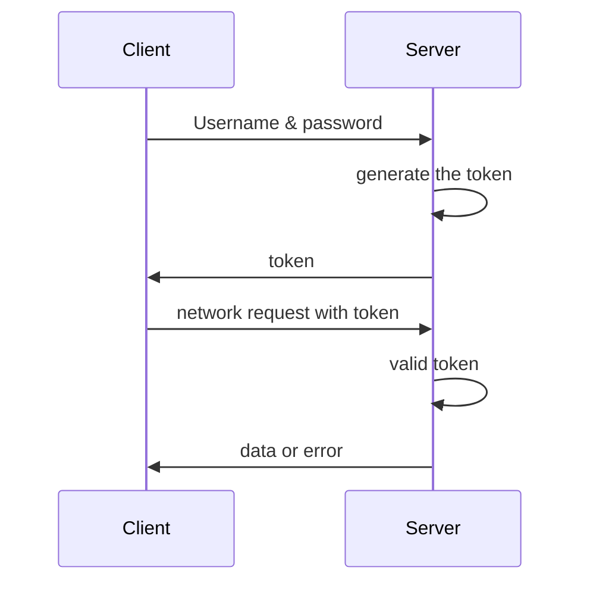

# Token

## The principle of Token



- Tokens can be stateless and can be shared across multiple services
- Make request without sending cookie to prevent CSRF attacks

# JWT (Json Web Token)

## Differences between traditional Token and JWT

- Traditional Token: The generated token on server needs to be stored locally on the server side, and subsequent requests need to be queried and checked to verify the validity of the token.
- JWT: The generated token does not need to be stored on the server

## Structure

- Token as a whole is made up of three major parts that is divided by '.'

  ```js
  eyJ0eXAiOiJqd3QiLCJhbGciOiJIUzI1NiJ9
    .eyJkYXRhIjp7Im5hbWUiOiJTbWFsbFN0YXJzIiwiYXV0aG9yaXR5IjoiMCJ9LCJleHAiOjE2MTExNTAxNzB9
    .ypNwF -
    BgqEl4HmuS -
    ulJRgKjz -
    RZJIMxtHv28K5cPm8;
  ```

- Header (Contains algorihm, types, etc. Use base64url encryption)

  ```json
  {
    "alg": "HS256",
    "typ": "JWT"
  }
  ```

- Payload (data. Use base64url encryption)

  ```json
  {
    "data": {
      "name": "SmallStars",
      "authority": "0"
    },
    "exp": 1611150170
  }
  ```

- Signature (Connect the first two parts of the ciphertext. Use HS256 encryption, and then the obtained ciphertext with base64url encryption)

  ```js
  // salt is your secret-key
  // base64url is base64 encrypted first and then '-' instead of '+' and '_' instead of '/'
  base64url(
    HMACHSHA256(base64UrlEncode(header) + "." + base64url(payload), salt)
  );
  ```

## Sample Code

- Generate Token

  ```python
  def create_token(payload, timeout=1):
      import jwt
      import datetime

      # header
      headers = {
          'typ': 'jwt',
          'alg': 'HS256'
      }
      payload['exp'] = datetime.datetime.utcnow() + datetime.timedelta(minutes=timeout)
      print(payload)

      token = jwt.encode(payload=payload, key=salt, headers=headers)
      return token
  ```

- Valid Token

  ```python
  def valid_token(request):
      try:
          token = request.form['token']

      except BaseException:
          return {
              'code': 1003,
              'error': 'Please login in'
          }

      import jwt
      payload = None
      error_msg = None
      try:
          payload = jwt.decode(token, salt, 'HS256')
      except jwt.ExpiredSignatureError:
          error_msg = 'Token is timeout'
      except jwt.DecodeError:
          error_msg = 'Token validation failed'
      except jwt.InvalidTokenError:
          error_msg = 'Token is invalid'

      if not payload:
          return {
              'code': 1003,
              'error': error_msg
          }
      return {
          'code': 1002
      }

  ```

## References

[Official Website](https://jwt.io/)

[Reference blog](https://www.cnblogs.com/ls-2018/p/11858551.html)

[Reference video](https://www.bilibili.com/video/BV1tJ411B7yJ?p=2)

[STA BackEnd Project](https://github.com/SmaIIstars/STA)
