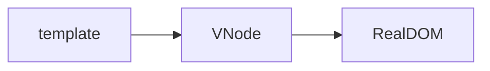
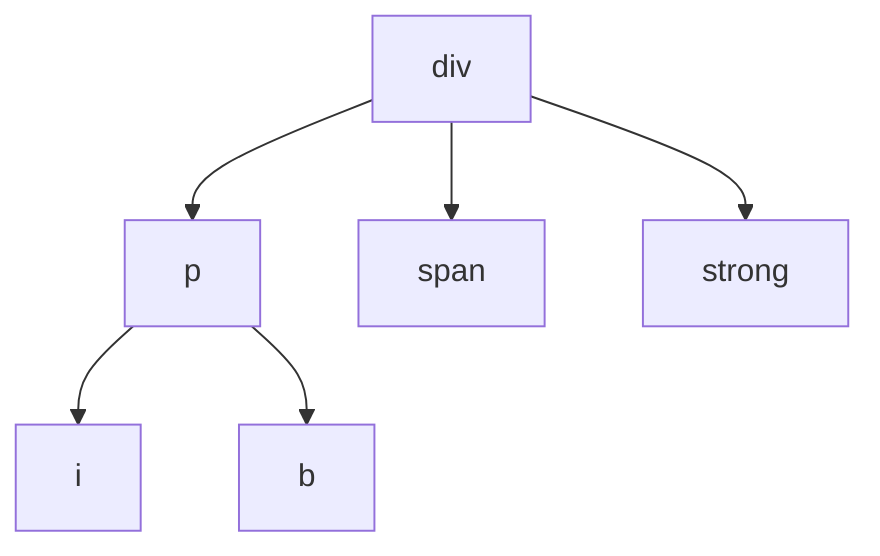
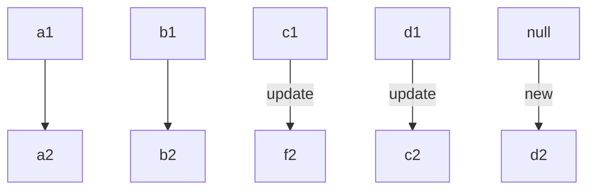

# Vue3

**Vue.js is a progressive JavaScript Framework**

## install

```bash
1. Via CDN
<script src="https://unpkg.com/vue@next"></script>

2. Scaffold via vite
npm init vite project-name -- --template vue
yarn create vite project-name --template vue

3. Scaffold via vue-cli
npm install -g @vue/cli
yarn global add @vue/cli
vue create project-name
```

## Lifecycles

**This is the complete life cycles of Vuejs, but the life cycle has changed in the setup in Vue3**


## Command

### v-once

**The itself and its subcomponent are only renderd once, and the view is no longer update when if the value changes**

```vue
<div v-once>{{ counter }}</div>
<button @click="increment">+</button>
<button @click="decrement">-</button>
```

### v-text

```vue
<!-- Their effect is the same -->
<h2 v-text="message"></h2>
<h2>{{ message }}</h2>
```

### v-html

**Parse the string of HTML code**

```vue
<!-- message:<span style="color:red"> SmallStars </span> -->
<h2>{{ message }}</h2>
<h2 v-html>{{ message }}</h2>
```

### v-pre

**Skip the compilation process of itself and its child elements**

```vue
<!-- {{ message }} -->
<h2 v-pre>{{ message }}</h2>
```

### v-cloak

**Before the element is compiled, add the v-cloak class attribute**

```vue
<template>
  <div v-cloak>{{ counter }}</div>
</template>

<script>
export default {
  data() {
    return {
      counter: 100,
    };
  },
};
</script>

<style scoped>
[v-cloak] {
  display: none;
}
</style>
```

### v-bind

**Dynamic binding of element**

```vue
<a v-bind:src="aLink"></a>
</img>

<!-- binding class -->
<!-- class: actived title -->
<div :class="{actived: isActive, 'title': false}">div</div>
<!-- this 'title' will be parsed  -->
<div :class="[actived, 'title']">div</div>
<!-- class: actived title abc-->
<div :class="[actived, 'title', isAbc ? 'abc' : '']">div</div>
<div :class="[actived, 'title', {abc: isAbc}]">div</div>

<!-- binding style -->
<div style="color: red"></div>
<div :style="{color: 'red', 'font-size': '14px'}"></div>
<div :style="{color: 'red', fontSize: finalFontSize + 'px'}"></div>
<div :style="{color: 'red', fontSize: finalFontSize + 'px'}"></div>
<div :style="[{color: 'red'}, {fontSize: finalFontSize + 'px'}]"></div>

<!-- binding attributes -->
<!-- userName: 'name' -->
<!--
info: {
	nickName = 'BlackAngel',
	age = 19,
}
-->
<!-- <div name = 'smallstars'></div> -->
<div :[userName]='smallstars'></div>
<div :[userName]='smallstars'></div>
<div v-bind='info'></div>
<div :='info'></div>
```

### v-on

**Used to bind events and monitor**

```vue
<button v-on:click="btnClick">btn1</button>
<button @mousemove="mouseMove">btn2</button>

<!-- binding the expression -->
<button @mousemove="counter++">{{counter}}</button>
<!-- binding object listens to multiple events -->
<button v-on="{ click: btnClick, mousemove: mousemove }">{{counter}}</button>
<button @="{click: btnClick, mousemove: mousemove}">{{counter}}</button>
<!-- Incoming parameters -->
<!-- An event parameter will be passed in by default -->
<button @click="btnClick">btn1</button>
<!-- $event to get event parameter -->
<button @click="btnClick($event, 'smallstars')">btn1</button>

<!-- Use of modifiers -->
<!-- 
.stop: event.stopPropagation()
.prevent: event.preventDefault()
.capture: Event listener uses capture mode
.once: Trigger only once
.left: Only click the left mouse button to take effect
.right: Only click the right mouse button to take effct
.middle: Only click the middle mouse button to take effct
-->
<button @click.stop="btnClick">btn1</button>
```

### v-if v-else-if v-else

**v-if is lazy. When the condition is false, the component will not be rendered or will be destroyed**

```vue
<input type="text" v-model="score"></input>
<h2 v-if="score > 90">excellent</h2>
<h2 v-else-if="score > 60">qualified</h2>
<h2 v-else>failed</h2>
```

### v-show

**First of all, v-show does not support template. The difference from**

```vue
<h2 v-show="isShow">excellent</h2>
```

### v-for

**Dynamic rendering the data**

```vue
<!-- array -->
<ul>
  <li v-for="(item, index) in items">{{index}}: {{item}}</li>
</ul>
<!-- object -->
<ul>
  <li v-for="(value, key, index) in info">{{key}}: {{value}}</li>
</ul>
<!-- number -->
<ul>
  <li v-for="(num, index) in 100">{{index}}: {{num}}</li>
</ul>
```

## Diff

### Vnode

**The essence of VNode(Virtual Node) is a JavaScript Object**

```js
// <div class="title" style="font-size: 30px; color: red;">Vnode</div>
const vnode = {
  type: 'div',
  props: {
    class: "title",
    style: {
      "font-size": "30px",
      color: "red"
    }
  },
  children: "Vnode"
}
```



```html
<!-- First convert the template to virtual DOM, and then mount it to the real DOM -->
<div>
  <p>
    <i>1</i>
    <b>2</b>
  </p>
  <span>3</span>
  <strong>4</strong>
</div>
```



### Diff

#### Unkeyed

**Different letters  represent different nodes (The number is added here to facilitate drawing). The nodes are compared in turn, and if they are different, the nodes are updated. Finallym if there are more old nodes than new nodes, the remaining nodes are removed, otherwish all of them are added.**



#### Keyed


## Source Code

**Here will brief explain part of the source code**

1. [vue@3.2.2](https://unpkg.com/vue@3.2.2/dist/vue.global.js)
2. [Search the vue-next in Github](https://github.com/vuejs/vue-next)

### Diff

```typescript
// packages/runtime-core/src/renderer.ts
// diff
const patchChildren: PatchChildrenFn = (
  n1, // old nodes
  n2, // new nodes
  container,
  anchor,
  parentComponent,
  parentSuspense,
  isSVG,
  slotScopeIds,
  optimized = false
) => {
  const c1 = n1 && n1.children
  const prevShapeFlag = n1 ? n1.shapeFlag : 0
  const c2 = n2.children

  const { patchFlag, shapeFlag } = n2
  // fast path
  if (patchFlag > 0) {
    if (patchFlag & PatchFlags.KEYED_FRAGMENT) {
      // this could be either fully-keyed or mixed (some keyed some not)
      // presence of patchFlag means children are guaranteed to be arrays
      // keyed
      patchKeyedChildren(
        c1 as VNode[],
        c2 as VNodeArrayChildren,
        container,
        anchor,
        parentComponent,
        parentSuspense,
        isSVG,
        slotScopeIds,
        optimized
      )
      return
    } else if (patchFlag & PatchFlags.UNKEYED_FRAGMENT) {
      // unkeyed
      patchUnkeyedChildren(
        c1 as VNode[],
        c2 as VNodeArrayChildren,
        container,
        anchor,
        parentComponent,
        parentSuspense,
        isSVG,
        slotScopeIds,
        optimized
      )
      return
    }
  }

  // children has 3 possibilities: text, array or no children.
  if (shapeFlag & ShapeFlags.TEXT_CHILDREN) {
    // text children fast path
    if (prevShapeFlag & ShapeFlags.ARRAY_CHILDREN) {
      unmountChildren(c1 as VNode[], parentComponent, parentSuspense)
    }
    if (c2 !== c1) {
      hostSetElementText(container, c2 as string)
    }
  } else {
    if (prevShapeFlag & ShapeFlags.ARRAY_CHILDREN) {
      // prev children was array
      if (shapeFlag & ShapeFlags.ARRAY_CHILDREN) {
        // two arrays, cannot assume anything, do full diff
        patchKeyedChildren(
          c1 as VNode[],
          c2 as VNodeArrayChildren,
          container,
          anchor,
          parentComponent,
          parentSuspense,
          isSVG,
          slotScopeIds,
          optimized
        )
      } else {
        // no new children, just unmount old
        unmountChildren(c1 as VNode[], parentComponent, parentSuspense, true)
      }
    } else {
      // prev children was text OR null
      // new children is array OR null
      if (prevShapeFlag & ShapeFlags.TEXT_CHILDREN) {
        hostSetElementText(container, '')
      }
      // mount new if array
      if (shapeFlag & ShapeFlags.ARRAY_CHILDREN) {
        mountChildren(
          c2 as VNodeArrayChildren,
          container,
          anchor,
          parentComponent,
          parentSuspense,
          isSVG,
          slotScopeIds,
          optimized
        )
      }
    }
  }
}
```

```typescript
// unked
const patchUnkeyedChildren = (
  c1: VNode[],
  c2: VNodeArrayChildren,
  container: RendererElement,
  anchor: RendererNode | null,
  parentComponent: ComponentInternalInstance | null,
  parentSuspense: SuspenseBoundary | null,
  isSVG: boolean,
  slotScopeIds: string[] | null,
  optimized: boolean
) => {
  c1 = c1 || EMPTY_ARR
  c2 = c2 || EMPTY_ARR
  // get length of old nodes
  const oldLength = c1.length
  // get length of new nodes
  const newLength = c2.length
  // get the minimum length
  const commonLength = Math.min(oldLength, newLength)
  let i

  for (i = 0; i < commonLength; i++) {
    const nextChild = (c2[i] = optimized
      ? cloneIfMounted(c2[i] as VNode)
      : normalizeVNode(c2[i]))

    // Compare nodes one by one
    patch(
      c1[i],
      nextChild,
      container,
      null,
      parentComponent,
      parentSuspense,
      isSVG,
      slotScopeIds,
      optimized
    )
  }

  // if the number of new nodes is less
  if (oldLength > newLength) {
    // remove old
    unmountChildren(
      c1,
      parentComponent,
      parentSuspense,
      true,
      false,
      commonLength
    )
  } else {
    // mount new
    mountChildren(
      c2,
      container,
      anchor,
      parentComponent,
      parentSuspense,
      isSVG,
      slotScopeIds,
      optimized,
      commonLength
    )
  }
}
```

